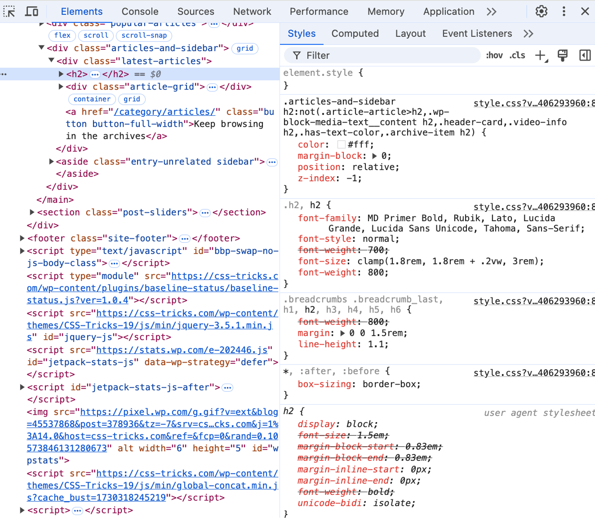

# Look and Feel - Corporate Identity

## Stylesheet

Je hebt na de Sprint Planning in Figma een styleguide gemaakt en een gezamenlijke stylesheet met de huisstijl van de opdrachtgever. 

Vandaag ga je leren hoe je een gestructureerd CSS file kan maken met _classes_ en _Custom Properties_. 

### Aanpak

Eerst ga je analyseren wat voor CSS strategie grote websites gebruiken. Daarna ga je met behulp van Custom Properties jullie gezamenlijke stylesheet structuren. Tot slot ga je het gezamenlijke stylesheet inladen en leren hoe je de styles kan toepassen op je project. 


## CSS strategie
Naarmate er meer CSS in je project komt, bijvoorbeeld als je gaat samenwerken aan een project, wordt het steeds belangrijker om een CSS strategie (met elkaar) te bepalen.

### Opdracht
Onderzoek op 3 verschillende websites hoe CSS is toegepast voor een `h2` en `button` element. 


*Met behulp van de Devtools kun je onderzoeken wat de CSS strategie van een website is.*

#### Beantwoord deze vragen op het whiteboard:
- Welke element-selectoren en class-selectoren zijn gebruikt?
- Welke properties staan er in welke selectoren?
- Wat valt op aan de naamgeving van classes en eventuele custom properties?

#### Onderzoek deze websites:  
- https://css-tricks.com/  
- https://www.smashingmagazine.com/  
- https://fdnd.nl/


## Custom Properties
Met Custom Properties kun je zelf een CSS `property` bedenken, daar een `value` in bewaren, en die op meerdere plekken gebruiken. Hiermee zorg je voor _DRY code_, wat de code beter leesbaar, makkelijker onderhoudbaar en sneller maakt. Dit is fijn voor de developers én de gebruikers.

```css
.card {
  --spacing: 1.2rem;
  padding: var(--spacing);
  margin: var(--spacing);
}
```

Sterker nog, je kunt de waardes aanpassen, en op die manier slimme styling schrijven:

```css
a {
  --saturation: 20%;
  color: hsl(50 var(--saturation) 40%);

  &:hover, &:focus {
    --saturation: 30%;
  }

  &:active {
    --saturation: 10%;
  }
}
```

Veel tutorials gebruiken de `:root` selector (het hoogste element in de DOM; het `<html>` element bij een webpagina, het `<svg>` element bij een SVG bestand) om custom properties op te zetten. Door _inheritance_ zijn die properties in de hele DOM daardoor bekend, maar custom properties zijn dus veel krachtiger dan alleen 'globale variabelen'."

### Opdracht

Jullie hebben een gezamenlijke stylesheet gemaakt met de styling voor de kleuren, typografie en formulier elementen. 

Bekijk welke elementen in de gezamenlijke stylesheet geschreven kunnen worden met custom properties. Denk bijvoorbeeld aan kleuren, font-sizes, borders, breedtes en/of hoogtes van elementen. Als waardes vaker voorkomen, kun je custom properties gebruiken.

Bespreek met een mentor de custom properties, classnames en code conventies die jullie hebben toegepast. 
Schets het 'ontwerp' van jullie stylesheet op het whiteboard en noteer zo nodig aanpassingen over bijvoorbeeld classnames en code conventies.

### Bronnen

- [Using CSS custom properties (variables)](https://developer.mozilla.org/en-US/docs/Web/CSS/Using_CSS_custom_properties)
- [CSS Custom Properties Guide](https://css-tricks.com/a-complete-guide-to-custom-properties/)

<!-- - [Breaking CSS Custom Properties out of :root Might Be a Good Idea](https://css-tricks.com/breaking-css-custom-properties-out-of-root-might-be-a-good-idea/) -->


### Opdracht Light & Dark mode (advanced)
Als je al ervaring hebt met custom properties kun je proberen een Light & Dark mode te maken. Een Light & Dark mode op de website helpt gebruikers om de website beter te kunnen bekijken in verschillende omstandigheden.

Implementeer een Dark Theme op basis van custom properties die werkt op basis van de voorkeuren van de gebruiker. Custom properties kunnen hierbij helpen om onnodige herhaling van bijvoorbeeld CSS values voor kleuren te voorkomen. 

Gebruik het artikel [Dark Mode in CSS](https://css-tricks.com/dark-modes-with-css/). 

Voor nog meer tips en tricks kun je het artikel [Dark Mode in 3 Lines of CSS and Other Adventures](https://dev.to/madsstoumann/dark-mode-in-3-lines-of-css-and-other-adventures-1ljj) lezen. 


## CSS inladen
Nu je met je team een gemeenschappelijke, generieke stylesheet hebt gemaakt, kan je deze gebruiken in jouw eigen project (leertaak).

[Hier wat uitleg over Specificity]

### Opdracht Specificity

Open je code editor en maak een blanco HTML pagina in je editor, nospecificity.html en sla deze op in de repo van je leertaak. Maak ook een blanco CSS file. 

Koppel de gemeenschappelijke stylesheet in de HTML van jouw project en koppel daaronder het blanco CSS file. 

Maak een 'h2' en een 'button' element in het HTML file en ...


<!-- Refactor jouw reeds bestaande lokale stylesheets. Hieruit kan alle overbodige CSS, die nu in de gemeenschappelijke stylesheet staat, worden verwijderd. -->


Verschillende manieren om een HTML element te benaderen via CSS

Element
Class
ID
Inline css


**

https://css-tricks.com/specifics-on-css-specificity/


